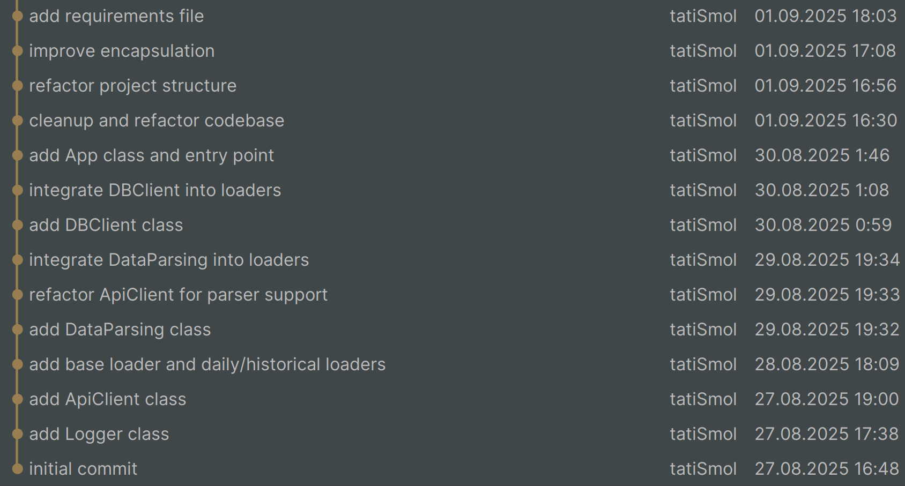

# Marketplace Data Service

## Описание проекта
Проект реализует полный цикл автоматизированного сбора данных по API, их загрузку в PostgreSQL-базу и визуализацию ключевых метрик через Metabase.
Цель - обеспечить стабильный поток данных для аналитики клиентской активности, продаж и ассортиментной матрицы.

## Структура проекта
<pre>
marketplace_data_service/
├── config/                     # переменные окружения - скрыта
│   └── .env
├── core/
│   ├── logger.py               # конфигурация логгирования
│   ├── api_client.py           # работа с API
│   ├── db_client.py            # работа с БД
│   └── data_parsing.py         # валидация и подготовка данных
├── loaders/
│   ├── base_loader.py          # базовый класс
│   ├── daily_loader.py         # ежедневная загрузка данных (`cron` в 07:00)
│   └── historical_loader.py    # единоразовая загрузка исторических данных
├── services/
│   └── app.py                  # бизнес-логика
├── logs/                       # логи
├── main.py                     # точка входа
├── .gitignore
└── README.md                   # документация
</pre>

## Автоматизация
- Загрузка исторических данных выполнена единоразово через `historical_loader.py`
- На сервере настроены следующие ежедневные cron-задачи:

  - В 6:50 удаляются лог-файлы старше 21 дня из папки _logs, чтобы избежать переполнения хранилища: 
    ```
    50 6 * * * find /root/marketplace_data_service/_logs/ -type f -mtime +21 -delete
    ```
  - В 7:00 запускается основной скрипт `main.py`, который собирает данные за предыдущий день и загружает их в базу данных (используя `app.py` -> `daily_loader.py`):
    ```
    0 7 * * * /bin/bash -c 'cd /root/marketplace_data_service && source venv/bin/activate && python main.py >> _logs/cron.log 2>&1'
    ```
  - В 7:05 cинхронизируются локальный (на виртуальном сервере) и удалённый (github) репозитории, чтобы избежать конфликтов при автокоммитах:
    ```
    5 7 * * * /bin/bash -c 'cd /root/marketplace_data_service && git pull origin master >> _logs/gitpull.log 2>&1'
    ```
  - В 7:10 выполняется автокоммит нового лог-файла на сервере, который пушится в удалённый репозиторий. Коммит также фиксирует удаление логов, если они были очищены ранее:
    ```
    10 7 * * * /bin/bash /root/marketplace_data_service/autocommit.sh >> /root/marketplace_data_service/_logs/autocommit.log 2>&1
    ```
  Все задачи выполняются по московскому времени. Логика построена так, чтобы данные были загружены до начала рабочего дня, а репозиторий оставался чистым и синхронизированным.
- Дашборд на Metabase показывает оперативную картину дня, недели, месяца. Фильтрация не предусмотрена. Дата на площадке обновляется в 03:00 по московскому времени, то есть данные могут быть не корректны всего 4 часа, пока не загрузятся новые в базу данных

## Доступ к базе данных
- Тип: PostgreSQL  
- IP: `83.166.244.221`  
- Порт: `5432`  
- База: `marketplace`  
- Пользователь: `analyst`  
- Пароль: `20Sptmbr25.`  
- Права: `SELECT` (только чтение)

## Дополнительно
- Все скрипты протестированы и работают стабильно  
- История коммитов отражает этапы разработки    
  🟥 **Обратите внимание**: часть коммитов от 1-го сентября отображается с одинаковой датой push-команды из-за особенностей работы PyCharm и единовременного пуша. Реальные даты коммитов сохранены локально и представлены на скриншоте ниже.
  
- Данные обновляются ежедневно  
- На основе данных 2023 года проведены два исследования, ссылки на которые приведены ниже

## Ссылки
[Metabase-дашборд](http://83.166.244.221:3000/public/dashboard/c4e62357-2861-42db-b9d4-6bf64ccd2b77) | 
[Исследование по товарам](https://colab.research.google.com/drive/1-GgtkfiF23Pc9EeZYgR2-GmeUNEbq5ZA?usp=sharing) | 
[Исследование по покупателям](https://colab.research.google.com/drive/1-FAPSTy9I-4TeSSNBaZD7iRkvyxZQkHm?usp=sharing)


